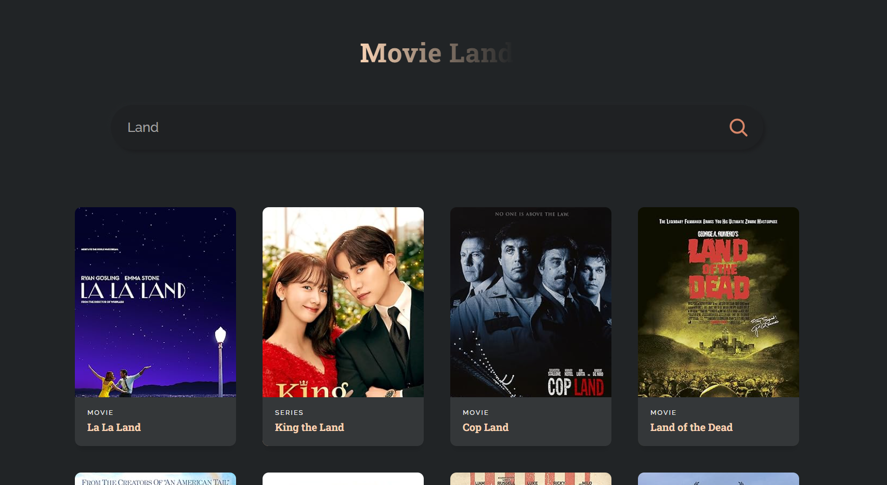

# MovieLand – My First React App

This is my very first React web application, built by following a beginner-friendly tutorial by [JavaScript Mastery](https://www.youtube.com/watch?v=b9eMGE7QtTk). It’s a simple movie search app that uses the OMDb API to display movie data by title.

<p align="center">
  
</p>

## Features

- React functional components
- `useState` and `useEffect` hooks
- Fetching data from an external API (OMDb)
- Basic conditional rendering
- Clean, beginner-friendly component structure

## What I Learned

- How to create and structure a React app
- JSX basics and component-based architecture
- Managing state and lifecycle with hooks
- Handling asynchronous API calls with `fetch`
- Styling with CSS and using SVGs in React

## Tech Stack

- **React** (with hooks)
- **JavaScript (ES6+)**
- **OMDb API** – [https://www.omdbapi.com](https://www.omdbapi.com)
- **CSS** for styling

## 📺 Tutorial Source

This app was built by following the YouTube tutorial:  
[React JS Crash Course 2022](https://www.youtube.com/watch?v=b9eMGE7QtTk) by JavaScript Mastery

## 🖼 Screenshot



## 🛠 To Run Locally

```bash
# Clone the repo
git clone https://github.com/your-username/movieland-app.git

# Install dependencies
npm install

# Start the development server
npm start
